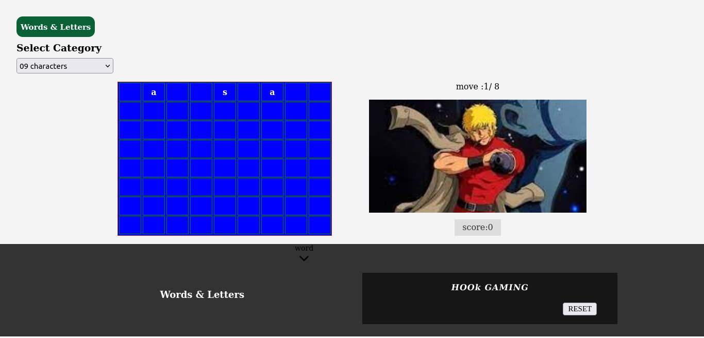
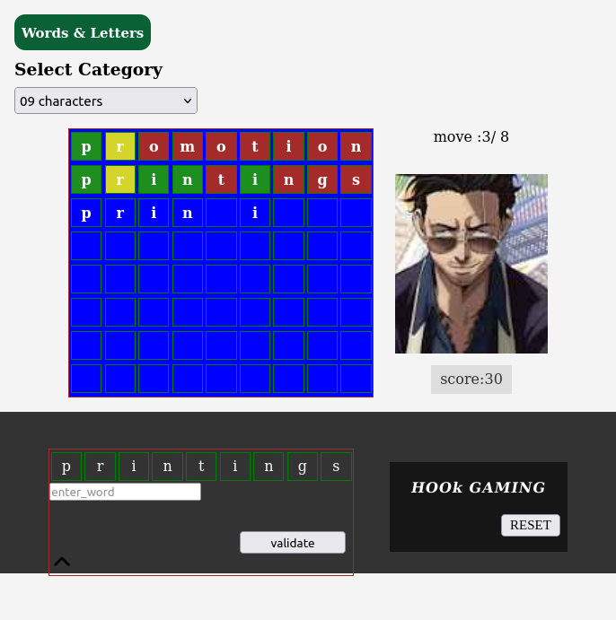

# Words Letters Game

Sideland : **## Words Letters Game**

> ### Overview :

- Learn some English words entertaining in your free time.

## Interest

You might be interested to know:

- how to **re-render** the DOM using multiple Side Effect with **useEffect Hook**
- how to implement **useContext API** with **React & Typescript**

### Links

- Solution URL: [https://github.com/BeinRain06/words-letters-game.git](https://github.com/BeinRain06/words-letters-game.git)
- Live Site URL: [https://beinrain06.github.io/words-letters-game/](https://beinrain06.github.io/words-letters-game/)

## Description : \* challenge issue

 

**Side Effect in Multiple Components**
 

Looks. The way we are used to re-render the DOM is by the help of **useEffect Hook**. In Which you give two variables as arguments : a **callback** and an **array** with inside variable of our code that we charge to provoke the re-render of the app. And Empty array means re-render just one time functions provided in callback.

> General Syntax : `useEffect(**callback**, [...variables or not])`

> running syntax e.g :

        `useEffect(() => {
    const discloseThreeCharacters = (): void => {
      let arrayThreeFirstChar: WordsObject[] = [];

      if (category === 9) {
        let baseWords: WordsObject[] = [];
        baseWords = NineCharactersWords.map((item) => item);

        console.log("right word abc", rightWords);

        for (let i = 0; i < rightWords.word.length; i++) {
          rightWordArray[i] = rightWords.word.charAt(i);
        }
      } else if (category === 8) {
        let baseWords: WordsObject[] = [];
        baseWords = EightCharactersWords.map((item) => item);

        for (let i = 0; i < rightWords.word.length; i++) {
          rightWordArray[i] = rightWords.word.charAt(i);
        }
      } else if (category === 10) {
        let baseWords: WordsObject[] = [];
        baseWords = TenCharactersWords.map((item) => item);

        for (let i = 0; i < rightWords.word.length; i++) {
          rightWordArray[i] = rightWords.word.charAt(i);
        }
      }

      idTmp = 1;
      // select first character
      let a = idTmp;
      arrayThreeFirstChar.push({
        id: a,
        word: rightWordArray[a],
      });

      idTmp = 4;
      // select second character
      let b = idTmp;
      arrayThreeFirstChar.push({
        id: b,
        word: rightWordArray[b],
      });

      idTmp = 6;
      // select third character
      let c = idTmp;
      arrayThreeFirstChar.push({
        id: c,
        word: rightWordArray[c],
      });

      //sort array three
      newThreeChar = arrayThreeFirstChar.sort((a, b) => a.id - b.id);

      handleFirstChar(newThreeChar);

      console.log("three first: ", newThreeChar);
    };

    discloseThreeCharacters();

}, []);`

Now. If you have **multiple components** you have to apply this type action using **wherever** one each **components** where data affects the display of the applications and you can call these **useEffect** many times in a particular components.

In my `App.tsx` file i call the **useEffect Hooks** two times.

> Why ?

Because i want my first HOok to re-render the function `discloseThreeCharacters();` once at all during the current flow running of the app before a reset.This function is in charge to initialize the **righwords** that we will try during the game to retrieve and also feed the we called `threeFirstChar` in charge of printing the first the characters of the rightwords when the game begin.

In my second UseFect HOOK the variables as `category, currentImg, score` are in charge of the re-render and i have write many functions inside the **callback** area.

In my `TemplateCharacters.tsx` i designed one **useEffect Hook** applying also changes to the U.I rendering of our App via variables like `wordEntered, countBoo, comeReset, count`

Now the Usual problem with data is to pass data between components.
 
 
 

**Affect Re-rendering of rows in TemplateCharacters.tsx**
 

Because i wanted every-time that my **input** tag inside `App.tsx` add char inside the active row located into `TemplateCharacters.tsx`. I needed to **share** a **common** `data` that will affect at the same time the both component on input writing.

> How To Do That ?

**Issue**
I define two data named `count` and `countBoo` and passed it as **props** from App.tsx (parent component) to TemplateCharacters.tsx (child component) but i get stuck when i needed to reset `countBoo` : the boolean variable to his initial value **false** . After being set **true** send as props to the child component and performed some actions involving the validation of our input value gave. The problem was to reset to **false **
because i get through the fact that value passed as **props** even if these value change in the current component where they are (for us **TemplateCharacters.tsx**) the state of these variables changed in this current component (using **reducer**) will not affect the state of the same variable being past used in the parent component(here **App.tsx**) where it was coming.

**Solution**
In That way we transform our code using **useReducer Hook** in one using rather **useContext api HooK** that are more reliable to manage **shared data** in time. And like this one just provide in a **wrapper component** (see **index.tsx**) all the variables involved in action in our program. When one variable change in a component. This Change has also an effect in the same named variable used in one another component.

**Remarks**
I also find out that as soon as you **change** a specific variable inside a function . You can't use this variabe inside the same functions in order to have his new value affected and continue to act.

This Change will be already available when be called into one another **function**

If you are really in need of this change inside the function you are performing you have to pre-call this variable using a **callback** function inside your function in touch , affect this callback to a **new variable** and then use this new variable to apply some duties instead of calling diirectly tne original variable inside the callback. You do an **inderect call**.
 
 
 

**How to pass from one Row to one Another in React**
 

We recall that in Javascript . A common way to select a couple of **tags** that we need to operate in **individually** or **globally** is to use `querySelectorAll(...className)`

But that is not the way that the things function in React . We can use querySelectorAll in **React** but it might sometimes end not **working**. React have in parrallel a Hook for that **useRef Hook** that works pretty well when selecting singular(one element) at time. Then the question was :

**Issue**
How To Select mutilples Tags elements In React ? Is it a way to do so with **useRef Hook** or we need to look elsewhere ?

**Solution**
We find out that we can use **multiple useRef Hook** call and encompasses all that in **one Array** that will be our **holding array to switch from one row to antoher** rather than manipulate querySelectorAll(...) along with Array.from(...) to have an array that target our elements.

E.g:

`const rowRefNine1 = useRef<HTMLDivElement>(null);
  const rowRefNine2 = useRef<HTMLDivElement>(null);
  const rowRefNine3 = useRef<HTMLDivElement>(null);
  const rowRefNine4 = useRef<HTMLDivElement>(null);
  const rowRefNine5 = useRef<HTMLDivElement>(null);
  const rowRefNine6 = useRef<HTMLDivElement>(null);
  const rowRefNine7 = useRef<HTMLDivElement>(null);
  const rowRefNine8 = useRef<HTMLDivElement>(null);
  const rowRefNine9 = useRef<HTMLDivElement>(null);`

**Our array :**

`const rowsRefNiNe = [
  rowRefNine1,
  rowRefNine2,
  rowRefNine3,
  rowRefNine4,
  rowRefNine5,
  rowRefNine6,
  rowRefNine7,
  rowRefNine8,
  rowRefNine9,
  ,
];`
 
 

**UseContext api Implementation with React/Typescript**
 

It was my first time to implement a program using **Typescript** . It's took me a good amount of time to **notice** that all in Typescript turn around **type** definition even it you use **primitive type** ( boolean, number, string, ...) or **advanced type** (Interface, Type, Generics). You can't think of a variable, a function, an Array without thinking of how you would declare **type** for all of them. Where Typecript seems to be bothering doing that , in fact is a way to help develop **debug** quickly the **error** in his program especially for large applications.It is one the power of **TypeScript** but to experience this power you have to will to learn the **verbose act** of writing **types**.
 
 
 

**Switch between three Categories**
 

The Game was designed to switch between **three categories** of template : **08 characters**, **09 characters**, **10 characters**. But we end up just implementing the side effect only for the
**Nine Characters** because we :

-Firstly doesn't yet **figure out** **how to switch** the function that generates the first three characters to print in our templates rows each time we either click on **08 characters** , **09 characters**, **10 characters**.

This function under the name **\*\*initRighWord \*\*** operates originally into `GameContext.tsx` file and extend to `App.tsx` under the name of `discloseThreeCharacters()`

**initRighWord** in GameContext.tsx file

    -         `
    -         const initRightWord: WordsObject =    NineCharactersWords[Math.floor(Math.random() * NineCharactersWords.length)];
    -
    -         const transformWordArray = (): string[] => {let rightWordArray: string[] = [];
    -
    -         for (let i = 0; i < initRightWord.word.length; i++) {rightWordArray[i] = initRightWord.word.charAt(i);}
    -
    -         return rightWordArray;};
    -
    -         letinitRightWordArray: string[] = transformWordArray();`

If we look closely to the code above we are going to see that there we called **NineCharactersWords** that represent the **library word** of Nine Characters.

We still struggle to write also **similar functions** that will handle **EighCharactersWords** and **TenCharactersWords** library when clicking to the option selection **08 characters** or **09 chararcters**

-Secondly , That means only one template can be called for the moment . It's why we finally comment two options select in our `App.tsx` at the place where we select category. We can als decide to make the Eight characters show or the Ten characters showe available for games. But for the times when one is selected(08 , 09, or 10) the two **others** selections have to be **disabled**.

**Picture**

---

---

## \*# What I learned \*

 

## useReducer with TypeScript and React

 

TypeScript we said earlier always asks for **types**. useReducer need also to provide some type before be used correctly.

> Wondering where ?

Well , we know useReducer defines **state** (by giving **INITIAL_STATE** of couples of **variables**) and actions by the mean of a known function called **reducer** . Now with TypeScript , useReducer need to specify type for state (**StateType**) and type for action (**ActionType**)

Now all the **subfunctions** of **reducer** need to define also for each a **subActionType**
That how it's work.
Look Example below:

> `type StateType = {
  category: number;
  rightWords: WordsObject;
  rightWordArray: string[];
  threeFirstChar: any[];
  wordEntered: string[];
  currentImg: string;
  count: number;
  level: number;
  countBoo: boolean;
  ...
};`

subActionType _e.g_ :

> `type CategoryActionType = {
  type: REDUCER_ACTION_TYPE.CHANGE_CATEGORY;
  field: string;
  data: string;
};`

> `
type SetIndexResetActionType = {
  type: REDUCER_ACTION_TYPE.RESET_ROWS | REDUCER_ACTION_TYPE.RESET_COUNT;
  payload: number;
};`

> `type ValidateActionType = {
  type: REDUCER_ACTION_TYPE.VALIDATE_BOOLEAN;
};`

Action Type _e.g_:

> `type ActionType =
| CategoryActionType
| CurrentWordActionType
| CurrentRightWordArrayActionType
| FirstCharActionType
| InputActionType
| MatchActionType
| ValidateActionType
| SetIndexResetActionType
| ScoreActionType
| UpdateCountActionType
| UpdateLevelActionType
 ...; `

## useContext api with TypeScript and React

 

Using **useContext api Hook** along with **useReducer Hook**

**1/** - Migrate all your useReducer **Features** ( **StateType , ActionType, subActionType, reducer** ) in a single new file named for e.g: `GameContext.tsx`

**2/** - write a function that will replace the usual declaration:

- `const [state, dispatch] = useReducer(reducer, INITIAL_STATE)`

and avoid writing many **dispatch** act that can lead confusing when anlywing the program.

This function have the name **noteGameContext** in our case and have **destructuring syntax** of **functions** and **state** to return :

- `state,
handleCategory,
changeBooleanCount,
updateLevel,
updateScore,
updateImage,
changeCount,
handleResetCount,
handleFirstChar,
handleChangeInput,
handleMatchingChar,
...`

**3/** - We are also on need to create a **new INITIAL_STATE** in **Typescript** able to initialize both **state**(all) and **functions** used to modify our state. This new _init_ is called here : **initContextState** and we have also defined new Type for this new state called **noteGameContextType**.

**Initial value new Init state**

> `const initContextState: noteGameContextType = {
  state: INITIAL_STATE,
  handleCategory: () => {},
  changeCount: () => {},
  handleResetCount: () => {},
  changeBooleanCount: () => {},
  updateLevel: () => {},
  updateScore: () => {},
  updateImage: () => {},
  handleFirstChar: () => {},
 ...
};`

**Initial type new Init Type**

> `type noteGameContextType = ReturnType<typeof noteGameContext>;`

**4/** - We then now **initialize** our context api to use :
`export const userGameContext =
  createContext<noteGameContextType>(initContextState);`

- like we were accustomed to use this syntax:
- `const [state, dispatch] = useReducer(reducer, INITIAL_STATE)`

in other files that needed **useReducer**

- we will now execute the syntax:
- `const {
state: {
category,
count,
countBoo,
level,
score,
currentImg,
threeFirstChar,
winOrLoose,
arraywordPlateRecord,
},
handleCategory,
changeCount,
handleResetCount,
changeBooleanCount,
updateLevel,
updateScore,
updateImage,
handleFirstChar,
...
} = useContext(userGameContext);`

inside other file to access functions and state variables we need coming from our context api file.

This is the power of **useContext** , **define your own **context\*\*

**5/** - Write and export the **provider function** of our context . Function that will help wrap our entire main component (**index.tsx**) to incorporate all state of our Context file and allow also to recognize when change are made inside all of component that are **children** of the **main** <file \*\*index.tsx\*\*>.

game Provider e.g:

        `export const GameProvider = ({children,...INITIAL_STATE}:ChildrenType & StateType): ReactElement => {return (<userGameContext.Provider value={noteGameContext(INITIAL_STATE)}>{children}</userGameContext.Provider>);};`

Children Type definition:

> `type ChildrenType = {
  children: ReactElement | undefined;
};`

**6/** - Wrap our main React compoment **index.tsx**

- destructuring syntax to pass:
- `const [
category,
threeFirstChar,
wordEntered,
count,
countBoo,
level,
score,
rightWords,
rightWordArray,
wordPlate,
paletteColors,
...,
] = [
INITIAL_STATE.category,
INITIAL_STATE.threeFirstChar,
INITIAL_STATE.wordEntered,
INITIAL_STATE.count,
INITIAL_STATE.countBoo,
INITIAL_STATE.level,
INITIAL_STATE.score,
INITIAL_STATE.rightWords,
INITIAL_STATE.rightWordArray,
INITIAL_STATE.wordPlate,
INITIAL_STATE.paletteColors,
...,
];`

- incorporate state variables for all components under `App.tsx`:
- `const root = ReactDOM.createRoot(document.getElementById("root"));`

-        ` root.render(<React.StrictMode>         <GameProvider category={category} threeFirstChar={threeFirstChar} wordEntered={wordEntered} count={count} countBoo={countBoo} level={level} score={score} rightWords={rightWords} rightWordArray={rightWordArray} wordPlate={wordPlate} paletteColors={paletteColors}...>
          <App />
      </GameProvider>
      </React.StrictMode>`

**7/** Call useContext using the syntax given on the **4/** points to have access on these **data** or **functions** customized in context api file :

**SYNTAX**:

- `const {
state: {
category,
count,
countBoo,
level,
score,
currentImg,
threeFirstChar,
winOrLoose,
arraywordPlateRecord,
},
handleCategory,
changeCount,
handleResetCount,
changeBooleanCount,
updateLevel,
updateScore,
updateImage,
handleFirstChar,
...
} = useContext(userGameContext);`

And **That Is It!**

### Mobile Responsiveness

    - Mobile reponsiveness for mobile min-width: 530px

**Picture**

---

---

## Callback History:

> **chidhood growth** this projects is inspired of the famous TV's Game usually shown on **France 2** , called "Des Mots et des Lettres"

**Entertain \ Learn New Words**

Growing Community.

## Useful Resources :

Codevolution[youtube] :

- [React TypeScript Webpack from Scratch](https://www.youtube.com/watch?v=Elpu7CIuqjY&list=PLC3y8-rFHvwiWPS2RO3BKotLRfgg_8WEo) : My backbone to configure my Typescript project with React. Amazing and very helpful.

Stackoverflow.com :

- [Using multiple refs on a single React element](https://stackoverflow.com/questions/60270678/using-multiple-refs-on-a-single-react-element) : Give me a clue to use as **selectors** in replacing of **queryselectorAll** an **array** of couple of useRef Hook here **rowsRefNiNe**

Bobby Hadz Blog :

- [How to type an async Function in TypeScript](https://bobbyhadz.com/blog/typescript-async-function-type) : Allows me to see how to write **async function** using typescript. This was my first idea when looking to reset **countBoo** a boolean variable after `validateChange()` function ends his duty

David Gray[youtube] :

- [ Learn useReducer with Typescript + React Hooks ](https://www.youtube.com/watch?v=lSY5R9ByO6Y) : How to use **useReducer with Typescript and React**.

David Gray[youtube] :

- [ Context API React + Typescript | useContext & useReducer Examples ](https://www.youtube.com/watch?v=05ZM4ymK9Nc) : How to use **useContext API with Typescript and React**.
   
   
   

## Acknowledge:

This project always remember the Team :

### \*\*Codevolution : without this one i will never have clues to setup **React and TypeScript** using webpack dev tools.

 
 

### \*\*Bobby Hadz : for his inside to how write async function with **Typsecript**

 
 

### \*\*StackOverflow Team : that helps me figure out a way to use multiple useRefs case for our **project**

 
 

### \*\*David Gray : for his ability to learn us how to use uesReducer Hook and UseContext Hook in real example with **Typescript**.

 

### _Our Work always remember these team_

 

## Author

### Frontend Mentor - [https://www.frontendmentor.io/profile/BeinRain06](https://www.frontendmentor.io/profile/BeinRain06)

 

### Twitter - [https://twitter.com/nest_Ngoueni](https://twitter.com/nest_Ngoueni)

 

### LinkedIn - [https://www.linkedin.com/in/ngouend-gerard-5a0584244/](https://www.linkedin.com/in/ngouend-gerard-5a0584244/)
